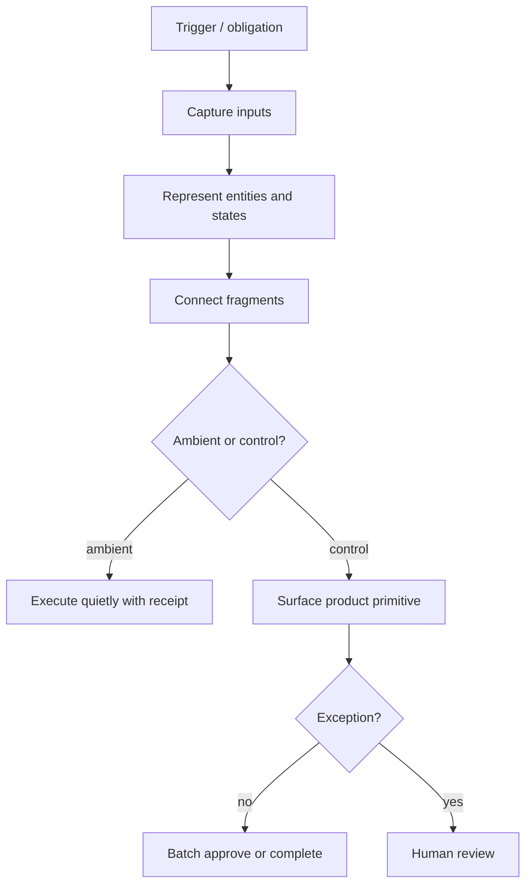

# Output format and quality bar

## Structure

````markdown
## Assumptions
[Source material, domain, user segment, and what the analysis was optimized for.]

## Workflow Candidates

| Workflow | Durable obligation | Fragmented representation | Hated burden | Strength |
|---|---|---|---|---|

## Deep Workflow Model: [Workflow Name]

### 1. Obligation
[Actor] must [produce/verify/decide/submit/reconcile/respond] [artifact/outcome] by [deadline/trigger] because [external force/consequence].

### 2. Building Blocks

**Actors:** [...]
**Entities:** [...]
**States:** [...]
**Transitions:** [...]
**Deadlines:** [...]
**Permissions:** [...]
**Dependencies:** [...]
**Evidence:** [...]
**Definition of done:** [...]

### 3. Fragment Map

| Fragment | Contains | Owner | Update frequency | Failure mode |
|---|---|---|---|---|

### 4. Action/Friction Kernel

| Step | Human action kernel | Friction kernel | Missing ingredient | What software can prepare | What must stay human |
|---|---|---|---|---|---|

### 5. Ambient vs Control

| Step | Action kernel | Friction kernel | Can it go ambient? | Why / why not | Surface type | User sees |
|---|---|---|---|---|---|---|

### 6. Product Primitives

| Step | Human action kernel | Friction kernel | Missing ingredient | Surface type | Product primitive | System behavior | Inputs used | Output produced | User control | Build spark |
|---|---|---|---|---|---|---|---|---|---|---|

### 7. Workflow Diagram



### 8. AI/Automation Insertion Points

| Step | Product primitive | Automation role | Likely mechanism | Mode | Confidence signal | Human control surface | Risk |
|---|---|---|---|---|---|---|---|

### 9. Exception Queue

| Exception | Why surfaced | Evidence shown | Suggested action | Human decision | Escalation path |
|---|---|---|---|---|---|

### 10. Intuition Gained
[The non-obvious understanding the representation created. Where AI fits, where it does not, and why the workflow looks different after mapping obligation, fragments, states, and exceptions.]

### 11. Product Implications
[What object the product should capture first, what tables or state machines it needs, which steps go ambient, which need a control surface, which primitives to design, which automations should be deterministic versus API-driven versus model-driven versus LLM-driven, what confidence signals make automation safe, what humans must approve, what should not be automated, and what prototype would test the workflow. Prefer the simplest mechanism that safely removes burden.]
````

## Quality bar

A good output reads as though the model watched the operator work and drew a map of the actual work system. The reader should finish thinking: *now I can see the workflow as an object, and I can see where AI fits.*

Prefer clear obligation statements, explicit building blocks, tables that separate candidates from fragments from kernels from ambient/control decisions from primitives from insertion points from exceptions, Mermaid diagrams that show state changes and handoffs, insertion points tied to primitives and confidence signals, and an `Intuition Gained` that changes how the reader sees the work.

## Failure signatures

- Generic startup idea lists, or "AI assistant for X" labels.
- Automation named before the work is represented; mechanism labels before action/friction analysis.
- Product ideas a designer could not sketch or a developer could not scope.
- Every pain treated as equally automatable; every automation given a visible UI.
- The current source of truth left unstated.
- Analysis that ends without product implications.
- Prose where a table would expose the structure.

## Red flags — say so when you see them

- The obligation is optional or fad-driven.
- The source material shows pain but no repeatable workflow.
- The workflow has no clear entities, states, or definition of done.
- A proposed AI step has no confidence signal.
- The automation would own high-stakes judgment without human accountability.
- The tool would have to replace an incumbent system before capturing any useful representation.
- The burden is emotional or political and the product can only offer generic coaching.
